# Personal Expense Tracker

## Description
A Java Swing application for tracking personal income and expenses.

---
## Features
- Add income
- Add expenses
- Delete transactions
- Save data to file
- Load data from file
- Calculate balance
- Input validation and error handling
- Automated testing using JUnit 4

---
## Technologies
- Java
- Swing
- JUnit 4
- Git & GitHub
---

## Project Structure

```text
src/
├── Transaction.java
├── ExpenseManager.java
├── FileHandler.java
└── ExpenseTrackerGUI.java

test/
└── ExpenseManagerTest.java
```

---
## Implemented Concepts

### Event Handling

The application uses ActionListeners to respond to user interactions such as:

- Adding transactions
- Deleting transactions
- Saving data
- Loading data

### Exception Handling

The application handles:

- Invalid numeric input
- Empty descriptions
- Negative or zero amounts
- File read/write errors
- Invalid user actions

### Code Refactoring

The project follows a modular design by separating responsibilities into different classes:

- **Transaction** – Represents a transaction record.
- **ExpenseManager** – Handles transaction management and balance calculations.
- **FileHandler** – Handles file operations.
- **ExpenseTrackerGUI** – Manages the graphical user interface.

### Unit Testing

JUnit 4 test cases are implemented for:

- Adding transactions
- Removing transactions
- Income calculations
- Expense calculations
- Mixed transaction calculations
- Negative amount validation
---
## How to Run
1. Clone the repository.
2. Open the project in IntelliJ IDEA / Eclipse.
3. Build the project.
4. Run ExpenseTrackerGUI.java.
5. Use the graphical interface to manage transactions.

--- 

## Screenshots
- Opening Tracker
  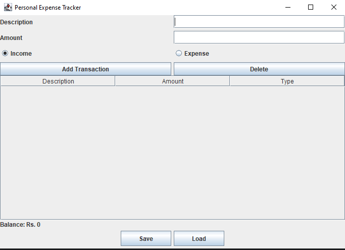
- Add Income
  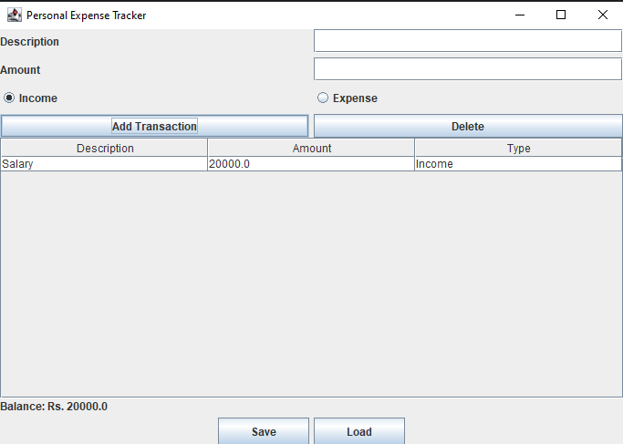
- Add Expense
  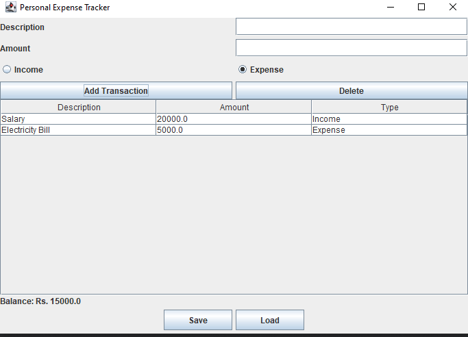
- Selecting From Table
  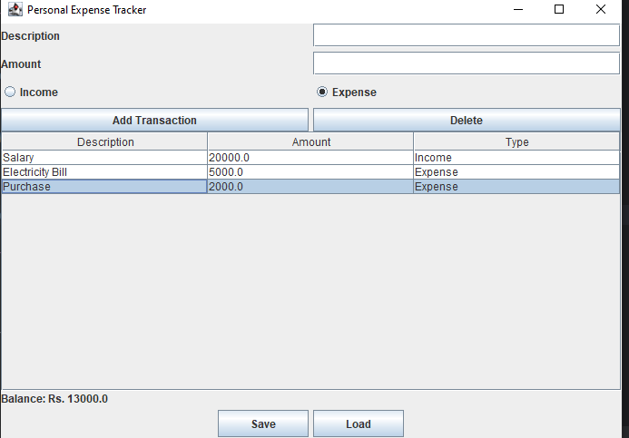
- Deleting Transaction
  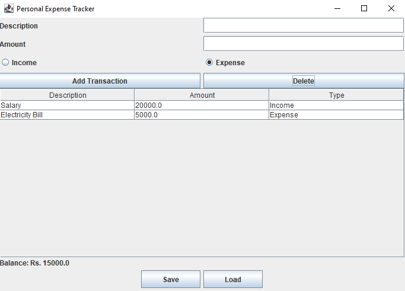
- Expense Exceed Balance
  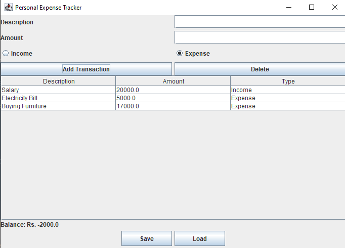
- Delete Without Selecting
  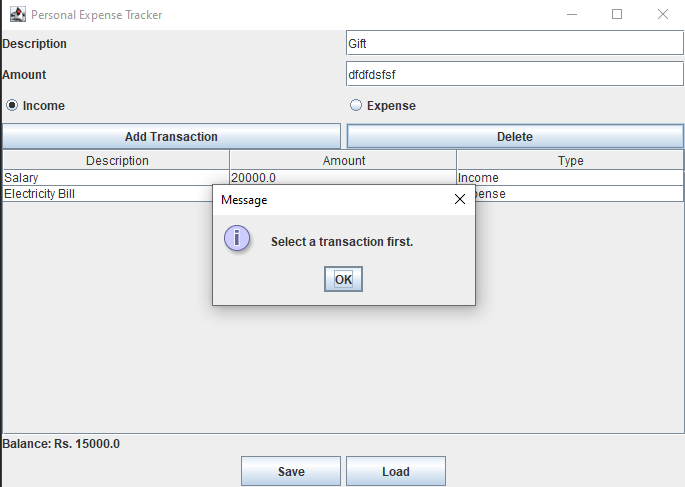
- Saving Transactions
  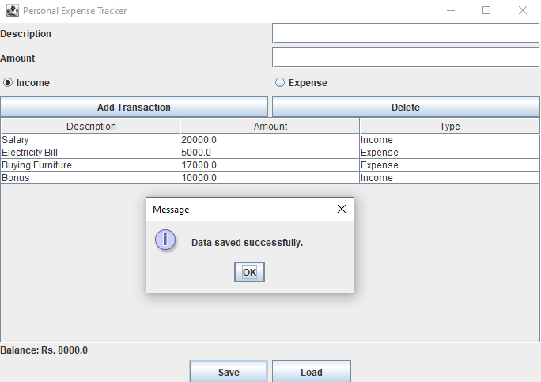
- Loading Transactions
  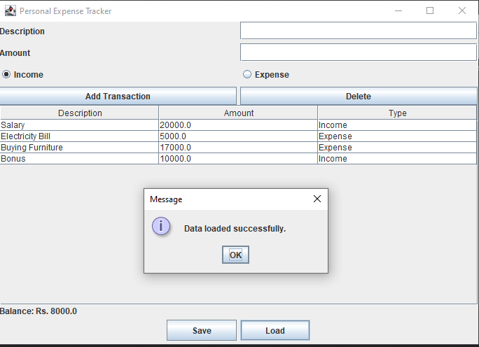
- Adding Negative Number
  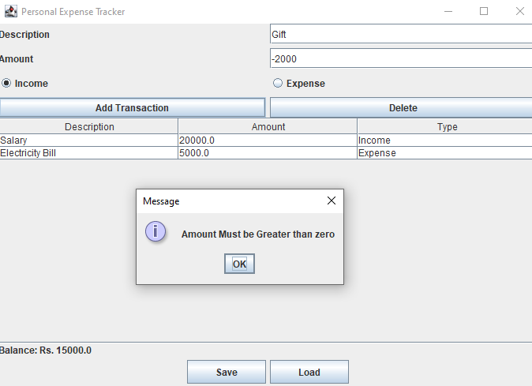
- Number Format Exception
  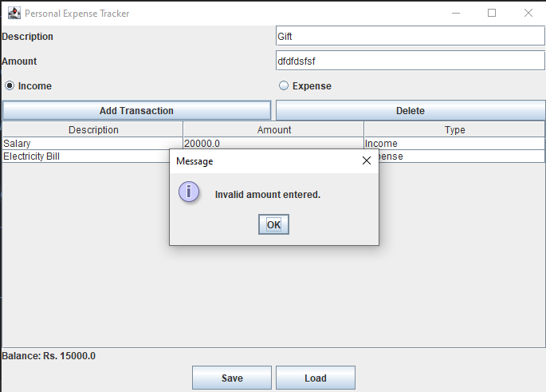
- Unit Test
  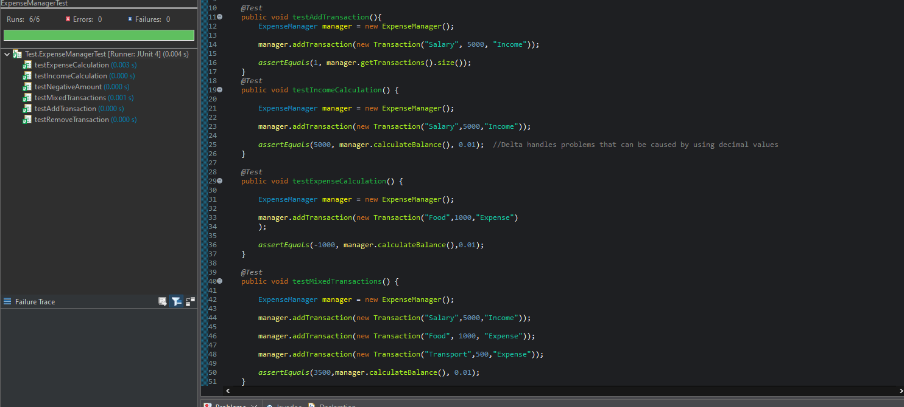

---

## Author
- Muhammad Maaz Javeed
